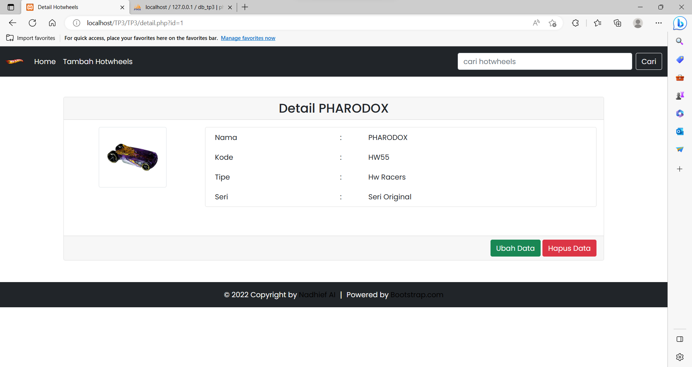

# TP3DPBO2023

## Janji
Saya Nadhief Athallah Isya dengan NIM 2106413 mengerjakan TP3 Praktikum DPBO dalam mata kuliah Desain Pemrograman Berorientasi Objek untuk keberkahan-Nya maka saya tidak melakukan kecurangan seperti yang telah dispesifikasikan. Aamiin.

## Deskripsi Tugas
Buatlah program menggunakan bahasa pemrograman PHP dengan
spesifikasi sebagai berikut:
- Program bebas, kecuali program Ormawa
- Menggunakan minimal 3 buah tabel
- Terdapat proses Create, Read, Update, dan Delete data
- Memiliki fungsi pencarian dan pengurutan data (kata kunci bebas)
- Menggunakan template/skin form tambah data dan ubah data yang sama
- 1 tabel pada database ditampilkan dalam bentuk bukan tabel, 2 tabel sisanya ditampilkan dalam bentuk tabel (seperti contoh saat praktikum)
- Menggunakan template/skin tabel yang sama untuk menampilkan tabel

## Desain program

## Alur Program
1. halaman home terdapat data hotwheels yang ada di database
2. lalu di navbar ada fitur tambah hotwheels, daftar seri, daftar tipe
3. di halaman tambah hotwheels ada form untuk memasukan nama hotwheels, gambar, seri, dan fotonya
4. di halaman daftar seri bisa menambhakan data hapus dan ubah, begitupun di halaman daftar tipe
5. di halaman home ketika menekan hotwheels nya maka akan masuk ke halaman detail hotwheels dan bisa crud didalamnya
## Dokumentasi

